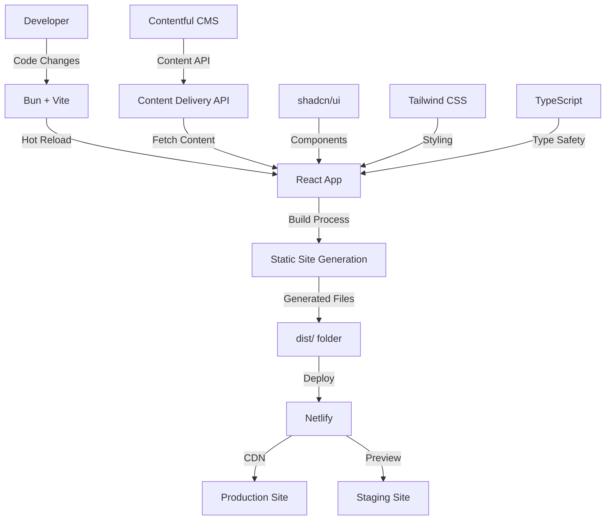

# Pilipinas Rotaract MDIO

Welcome to the official repository for the Pilipinas Rotaract Multi-District Information Organization (MDIO) website!

## Project Info

- **Production Site:** [http://pilipinasrotaract.org/](http://pilipinasrotaract.org/)
- **Staging Site:** [https://mdio-pilipinas.netlify.app/](https://mdio-pilipinas.netlify.app/)

## Tech Stack

This project is built with:

- [Bun](https://bun.sh/) – Fast all-in-one JavaScript runtime
- [Vite](https://vitejs.dev/) – Next Generation Frontend Tooling
- [TypeScript](https://www.typescriptlang.org/) – Typed JavaScript at Any Scale
- [React](https://react.dev/) – A JavaScript library for building user interfaces
- [shadcn/ui](https://ui.shadcn.com/) – Beautifully designed UI components
- [Tailwind CSS](https://tailwindcss.com/) – Utility-first CSS framework
- [Contentful](https://www.contentful.com/) – Headless Content Management System

## Architecture Overview



## Getting Started

Follow these steps to set up and run the project locally:

### Prerequisites
- [Bun](https://bun.sh/) (Install via `curl -fsSL https://bun.sh/install | bash`)
- Contentful API credentials (for content management)

### Installation & Development

1. **Clone the repository:**
   ```sh
   git clone <YOUR_GIT_URL>
   cd pilipinas-rotaract-mdio-website
   ```
2. **Install dependencies:**
   ```sh
   bun install
   ```
3. **Set up environment variables:**
   Create a `.env` file with:
   ```
   VITE_CONTENTFUL_SPACE_ID=your_space_id
   VITE_CONTENTFUL_ACCESS_TOKEN=your_access_token
   VITE_CONTENTFUL_ENVIRONMENT=master
   ```
4. **Start the development server:**
   ```sh
   bun run dev
   ```
   The app will be available at [http://localhost:5173](http://localhost:5173) by default.

## Development Tools

### Contentful Type Generation

This project uses automatic type generation for Contentful models:

```bash
bun run generate-contentful-types
```

The generated types will be available in `src/types/`.

## Build

### Static Site Generation (SSG)

To build the project for production with static site generation:

```bash
# Build for production
bun run build:ssg
```

This command will:
- Generate TypeScript types from Contentful
- Compile TypeScript to JavaScript
- Bundle and optimize all assets with Vite
- Create a `dist/` folder with static files ready for deployment

### Preview Production Build

To preview the production build locally:

```bash
# Preview the built site
bun run preview
```

The preview will be available at [http://localhost:4173](http://localhost:4173) by default.

## Deployment

- Deploy to [Netlify](https://www.netlify.com/) or your preferred static hosting provider
- For custom domains, see [Netlify custom domains guide](https://docs.netlify.com/domains-https/custom-domains/)

## Contributing

Pull requests are welcome! For major changes, please open an issue first to discuss what you would like to change.

## License

This project is licensed under the MIT License.
