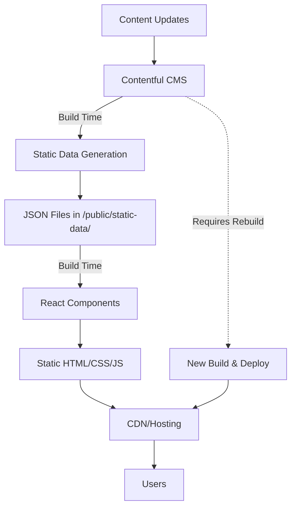

# Pilipinas Rotaract MDIO Website

A static website built for the Pilipinas Multi-District Information Organization (MDIO) showcasing Rotaract districts, events, leadership, and foundation initiatives across the Philippines.

**Live Site:** [pilipinas-rotaract.vercel.app](https://pilipinas-rotaract.vercel.app)  
**Staging:** [staging.pilipinas-rotaract.vercel.app](https://staging.pilipinas-rotaract.vercel.app)

## Tech Stack

- **Runtime:** [Bun](https://bun.sh)
- **Build Tool:** [Vite](https://vitejs.dev)
- **Language:** [TypeScript](https://www.typescriptlang.org)
- **Framework:** [React 18+](https://react.dev)
- **UI Components:** [shadcn/ui](https://ui.shadcn.com) ([Radix UI](https://www.radix-ui.com) primitives)
- **Styling:** [Tailwind CSS](https://tailwindcss.com)
- **CMS:** [Contentful](https://www.contentful.com) (headless CMS)
- **Deployment:** [Vercel](https://vercel.com)
- **Architecture:** **True Static Site Generation (SSG)**

## Architecture Overview

This website uses **True Static Site Generation (SSG)** - all content is pre-generated at build time and served as static files.



### Key Features:
- **Zero Runtime API Calls** in production
- **Lightning Fast** loading times
- **SEO Optimized** with pre-rendered content
- **CDN Friendly** - fully static assets
- **Offline Capable** after initial load

## Getting Started

### Prerequisites

- [Bun](https://bun.sh) - JavaScript runtime and package manager
- Node.js (for compatibility)
- Contentful account (for content management)

### Installation

1. **Clone the repository**
   ```bash
   git clone https://github.com/your-username/pilipinas-rotaract-mdio-website.git
   cd pilipinas-rotaract-mdio-website
   ```

2. **Install dependencies**
   ```bash
   bun install
   ```

3. **Set up environment variables**
   
   Create a `.env` file in the root directory:
   ```env
   # Contentful Configuration
   VITE_CONTENTFUL_SPACE_ID=your_space_id
   VITE_CONTENTFUL_ACCESS_TOKEN=your_access_token
   VITE_CONTENTFUL_ENVIRONMENT=master
   ```

4. **Generate static data**
   ```bash
   bun run generate-static-data
   ```

5. **Start development server**
   ```bash
   bun run dev
   ```

6. **Build for production**
   ```bash
   bun run build
   ```

7. **Preview production build**
   ```bash
   bun run preview
   ```

## Static Site Generation (SSG) Behavior

### True SSG in Production
- **No API calls** are made to Contentful during runtime
- All content is loaded from pre-generated JSON files
- Content is **frozen at build time**
- New content requires a **rebuild and redeploy**

### Development Mode
- Tries to use live API calls to Contentful for easier development
- Falls back to static data if API is unavailable
- Falls back to hardcoded fallback data if both API and static data fail

### Content Update Workflow
1. Update content in Contentful CMS
2. Run `bun run generate-static-data` to fetch latest content
3. Run `bun run build` to build the site with new content
4. Deploy the updated `dist/` folder

### Environment Variable Reference

| Variable | Description | Default | Required |
|----------|-------------|---------|----------|
| `VITE_CONTENTFUL_SPACE_ID` | Contentful space ID | - | ✅ |
| `VITE_CONTENTFUL_ACCESS_TOKEN` | Contentful access token | - | ✅ |
| `VITE_CONTENTFUL_ENVIRONMENT` | Contentful environment | `master` | ❌ |

**Note:** In production, only static data is used. Development mode can use live API calls as the primary source.

## Scripts

| Command | Description |
|---------|-------------|
| `bun run dev` | Start development server |
| `bun run build` | Build for production |
| `bun run preview` | Preview production build |
| `bun run generate-static-data` | Generate static data from Contentful |
| `bun run lint` | Run ESLint |
| `bun run type-check` | Run TypeScript checks |

## Project Structure

```
src/
├── components/          # React components
│   ├── ui/             # shadcn/ui components
│   └── sections/       # Page sections
├── pages/              # Page components
├── lib/                # Utilities and services
│   ├── contentful.ts   # Contentful service layer
│   └── utils.ts        # Helper functions
├── data/               # Static data and fallbacks
├── types/              # TypeScript type definitions
└── styles/             # Global styles

public/
├── static-data/        # Generated static JSON files
├── assets/             # Static assets
└── ...                 # Other public files

scripts/
└── generate-static-data.ts  # Static data generation script
```

## Contributing

1. Fork the repository
2. Create a feature branch (`git checkout -b feature/amazing-feature`)
3. Make your changes
4. Generate updated static data if needed (`bun run generate-static-data`)
5. Test your changes (`bun run build && bun run preview`)
6. Commit your changes (`git commit -m 'Add some amazing feature'`)
7. Push to the branch (`git push origin feature/amazing-feature`)
8. Open a Pull Request

## License

This project is licensed under the MIT License - see the [LICENSE](LICENSE) file for details.

## Support

For support, please contact the Pilipinas Rotaract MDIO team or create an issue in this repository.
